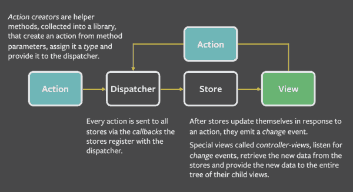

# 软件架构与框架
## 描述软件架构与框架之间的区别与联系
### 定义：
- 软件架构: 软件架构是一个系统的草图。软件架构描述的对象是直接构成系统的抽象组件。各个组件之间的连接则明确和相对细致地描述组件之间的通讯。设计软件架构就是把系统分解为一些部件，描述这些部件的职责及它们之间的协作行为。   
- 软件框架：软件框架是面向领域（如 ERP、计算领域等）的、可复用的“半成品”软件，它实现了该领域的共性部分，并提供了一些定义良好的可变点以保证灵活性和可扩展性。也就是说软件框架是领域分析结果的软件化，是领域内最终应用的模板，是特定语言和技术的架构应用解决方案。   
### 区别:
软件的架构是一个系统草图，是关于软件设计方面的重要的决策，它将软件规范的分为各个部分，并且决定各部分内部结构以及各部分之间的联系。经过开发之后，软件架构可以体现在软件当中。   

而软件框架是软件的一部分，它是软件的半成品，为软件提供基础的结构和一些规范约束，然后开发人员在软件框架的基础上进行开发。

### 联系：

软件架构和软件框架的联系 框架技术和架构技术的出现，都是为了解决系统日益复杂所带来的困难而采取的“分而治之”的思维的结果 - 先大局后局部，就出现了架构；先通用后专用，就出现了框架。架构是问题的抽象解决方案，关注大局而忽略细节；而框架是通用半成品，还必须根据具体需求进一步定制开发才能变成应用系统。  

软件架构引导开发人员设计软件框架，是软件框架的重要决策。也就是说软件架构体现在软件框架中。  

## 以你的项目为案例
### 绘制三层架构模型图，细致到分区

### 结合你程序的结构，从程序员角度说明三层架构给开发者带来的便利
- 总的来说，使用三层架构可以做到关系分离、高级服务与低级服务分离、特定于应用的服务与一般性服务分离。三层架构可以减少耦合和依赖性、增强内聚性、提高潜在的复用性并且使概念更加清晰。这可以使得不同层的开发者之间专注于本层开发，而无需考虑除本层以外的开发。在我的程序中，UI层、数据层和服务器层三者之间的耦合度很小，从而使得各层的开发相互独立，大大提高了开发和调试的效率。
- 封装和分解了相关的复杂性，有利于提供开发效率。在我的程序中，显示租人列表、处理租人项和订单数据，存储交易数据相互分开，数据流得到了有效组织和管理，从而大大减少了开发复杂度。
- 较低层的复用性较高，为开发者减少了重新开发的麻烦以及代码量。
- 通过逻辑划分，有利于开发者进行高效的团队开发。
- 各个层次清晰，每个层次都提供了接口定义：
    - 很容易用新的实现替换原来的层次实现。例如对sql进行性能优化，并不会影响其他层的代码结构。有利于后期维护。
    - 有利于实现切面编程，减轻业务的复杂程度，加快编码效率。
    - 每个层次的定位明晰，业务处理的内容明确。依据层次，可以划分不同的分工。开发人员可以只关注整个结构的其中某一层。 
    - 接口定义也提供了良好的可扩展性。

- 接口设计需要符合对扩展开发，对修改关闭的原则，增强了系统的安全性

## 研究 VUE 与 Flux 状态管理的异同

FLUX结构图：

VUE结构图:

异：

- Flux是一种前端状态管理架构思想，专门解决软件的结构问题。基于Flux的设计思想，出现了一批前端状态管理框架。
- Vue的状态管理是通过Vuex来实现的，而Vuex是基于Flux设计思想的一个状态管理框架。
- Flux分为四层，分别是view、action、dispatcher和store，而它的数据流顺序为： View发起Action -> Action传递到Dispatcher -> Dispatcher将通知Store -> Store的状态改变通知View进行改变
- Vuex的核心为：
    - state：存放多个组件共享的状态（数据）
    - mutations：存放更改state里状态的方法，用于变更状态，是唯一一个更改状态的属性
    - getters：将state中某个状态进行过滤，然后获取新的状态，类似于vue中的computed
    - actions：用于调用事件动作，并传递给mutation
    - modules：主要用来拆分state vuex的数据流顺序为： View调用store.commit提交对应的请求到Store中对应的mutation函数 -> store改变(vue检测到数据变化自动渲染)

同：

- 由于Vuex是基于Flux开发的，因此它们在思想上是相同的。
- Flux和Vuex都是通过store来存储状态。